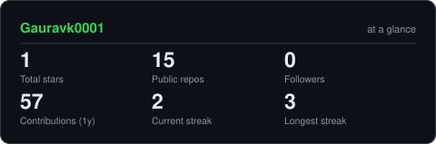
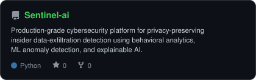
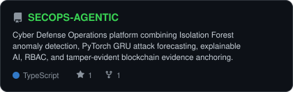
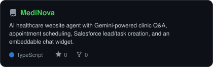

</td>
<td width="50%" align="center" valign="middle">

<!-- Live language radar - generated from GitHub repository language data -->

<picture>
  <source media="(prefers-color-scheme: dark)" srcset="assets/radar-langs-dark.svg">
  <source media="(prefers-color-scheme: light)" srcset="assets/radar-langs-light.svg">
  
</picture>

</td>
</tr>
</table>

---

## `~/` contribution calendar

<!-- 3D isometric calendar - generated by GitHub Actions -->

  

<!-- Snake contribution graph -->

<picture>
  <source media="(prefers-color-scheme: dark)" srcset="https://raw.githubusercontent.com/Gauravk0001/Gauravk0001/output/snake-dark.svg">
  <source media="(prefers-color-scheme: light)" srcset="https://raw.githubusercontent.com/Gauravk0001/Gauravk0001/output/snake.svg">
  
</picture>

---

## `~/` the numbers

<!-- Generated by scripts/cards.py -->

<picture>
  <source media="(prefers-color-scheme: dark)" srcset="assets/card-stats-dark.svg">
  <source media="(prefers-color-scheme: light)" srcset="assets/card-stats-light.svg">
  
</picture>

 

  

---

## `~/` selected work

<!-- Cards generated by scripts/cards.py from assets/projects.json -->

<table>
<tr>
<td width="50%">
  <a href="https://github.com/Gauravk0001/Sentinel-ai">
    <picture>
      <source media="(prefers-color-scheme: dark)" srcset="assets/card-Sentinel-ai-dark.svg">
      <source media="(prefers-color-scheme: light)" srcset="assets/card-Sentinel-ai-light.svg">
      
    </picture>
  </a>
</td>

<td width="50%">
  <a href="https://github.com/Gauravk0001/AuraSight">
    <picture>
      <source media="(prefers-color-scheme: dark)" srcset="assets/card-AuraSight-dark.svg">
      <source media="(prefers-color-scheme: light)" srcset="assets/card-AuraSight-light.svg">
      
    </picture>
  </a>
</td>
</tr>

<tr>
<td width="50%">
  <a href="https://github.com/Gauravk0001/SECOPS-AGENTIC">
    <picture>
      <source media="(prefers-color-scheme: dark)" srcset="assets/card-SECOPS-AGENTIC-dark.svg">
      <source media="(prefers-color-scheme: light)" srcset="assets/card-SECOPS-AGENTIC-light.svg">
      
    </picture>
  </a>
</td>

<td width="50%">
  <a href="https://github.com/Gauravk0001/MediNova">
    <picture>
      <source media="(prefers-color-scheme: dark)" srcset="assets/card-MediNova-dark.svg">
      <source media="(prefers-color-scheme: light)" srcset="assets/card-MediNova-light.svg">
      
    </picture>
  </a>
</td>
</tr>
</table>

| project                                                             | focus                                                    |
| ------------------------------------------------------------------- | -------------------------------------------------------- |
| **[Sentinel-ai](https://github.com/Gauravk0001/Sentinel-ai)**       | `AI/ML` `Cybersecurity` `FastAPI` `React`                |
| **[AuraSight](https://github.com/Gauravk0001/AuraSight)**           | `Multimodal AI` `Accessibility` `FastAPI` `React Native` |
| **[SECOPS-AGENTIC](https://github.com/Gauravk0001/SECOPS-AGENTIC)** | `Cybersecurity` `PyTorch` `Blockchain` `React`           |
| **[MediNova](https://github.com/Gauravk0001/MediNova)**             | `AI Agents` `TypeScript` `Gemini` `Salesforce`           |

---

### `~/` let's build something useful

I'm open to **freelance projects, collaborations, internships, and opportunities** involving AI/ML, cybersecurity, full-stack development, automation, and intelligent applications.

  

`01110100 01101000 01100001 01101110 01101011 01110011 00100000 01100110 01101111 01110010 00100000 01110011 01100011 01110010 01101111 01101100 01101100 01101001 01101110 01100111`

